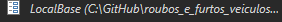
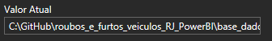

<h1 align = center>  Análise de Vendas - Livraria 📚 <h1/>

  
  

  
  

## 📌 Visão Geral
Dashboard interativo desenvolvido no **Power BI** para monitoramento completo do negócio.

### Principais Destaques
- ✔ Visão 360° das operações
- ✔ Análise em tempo real
- ✔ Painéis complementares integrados

---

## 
🛠️ Tech Stack

  
  
  

---

 ## ❓ Utilização do Projeto

- O arquivo do Power BI, por possuir uma tabela que não é hospedada em algum site, para funcionar, deve seguir alguns passos:

|   Ação   | Imagem                                                                                                                                                                                                                                                                         |
| :------: | ------------------------------------------------------------------------------------------------------------------------------------------------------------------------------------------------------------------------------------------------------------------------------ |
|  Ao baixar a pasta do projeto, abra o Power BI    | 
|  Clicar em Transformar Dados:  |  |
| Clicar em Local Base | |
| Verificar o caminho no seu computador de onde está a tabela DP e copiar |  |
| Colar esse caminho no campo valor do Local Base |  |

---

