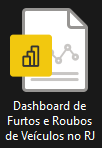

<h1 align = center>  Análise de Vendas - Livraria 📚 <h1/>

  
  

  
  

## 
📌 Sobre

Dashboard georreferenciado desenvolvido no **Power BI** para análise de Livrarias, utilizando dados abertos do RJ.  
*Projeto acadêmico em parceria com [RioOn](https://rioon.rio.br/) e [Senac RJ](https://www.rj.senac.br/).*

### Principais Benefícios
✔ Visão unificada de todas as operações  
✔ Análise em tempo real  
✔ Painéis complementares integrados  

---

## 
🛠️ Tech Stack

  
  
  

---
## 📂 Dados Usados + Dashboard
- [Acesse o arquivo no Google Drive: Clique ]( https://drive.google.com/drive/folders/1sxzV2i_pjKUzwZWoqA3dgmaiAvIDJDfz?usp=drive_link)
 #### 📝 Nota: neste link você terá acesso a:
- Dados, Imagens e o Dashboard.
---
## 📊 Métricas Principais

### Visão Geral
- Performance de vendas (R$ e unidades)  
- Ticket médio por período  
- Distribuição por tipo de pagamento  

### Produtos
- Top 5 livros mais vendidos  
- Top 10 gêneros mais lidos  
- Evolução mensal de faturamento  

### Filiais
- Ranking de desempenho por loja  
- Regiões com maior volume de entregas  
- Faturamento comparativo por região  

### Vendas
- Top 3 vendedores (geral e por filial)  
- Evolução diária/semanal de faturamento  
- Conversão por canal de venda  

---

 ## ❓ Utilização do Projeto

- O arquivo do Power BI, por possuir uma tabela que não é hospedada em algum site, para funcionar, deve seguir alguns passos:

|   Ação   | Imagem                                                                                                                                                                                                                                                                         |
| :------: | ------------------------------------------------------------------------------------------------------------------------------------------------------------------------------------------------------------------------------------------------------------------------------ |
|  Ao baixar a pasta do projeto, abra o Power BI    | 
|  Clicar em Transformar Dados:  |  |
| Clicar em Local Base | |
| Verificar o caminho no seu computador de onde está a tabela DP e copiar |  |
| Colar esse caminho no campo valor do Local Base |  |

---

